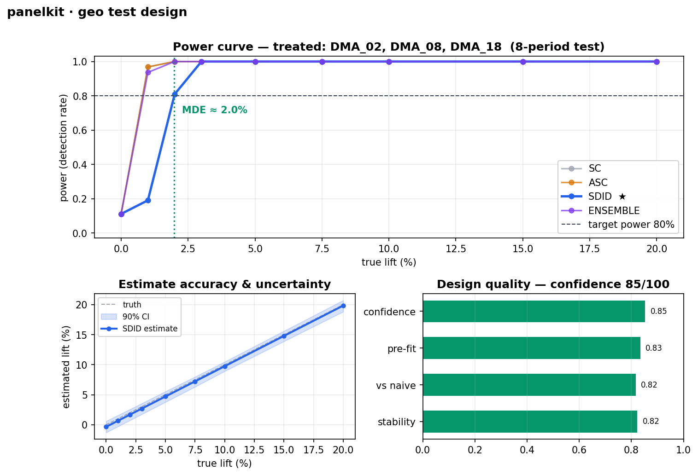
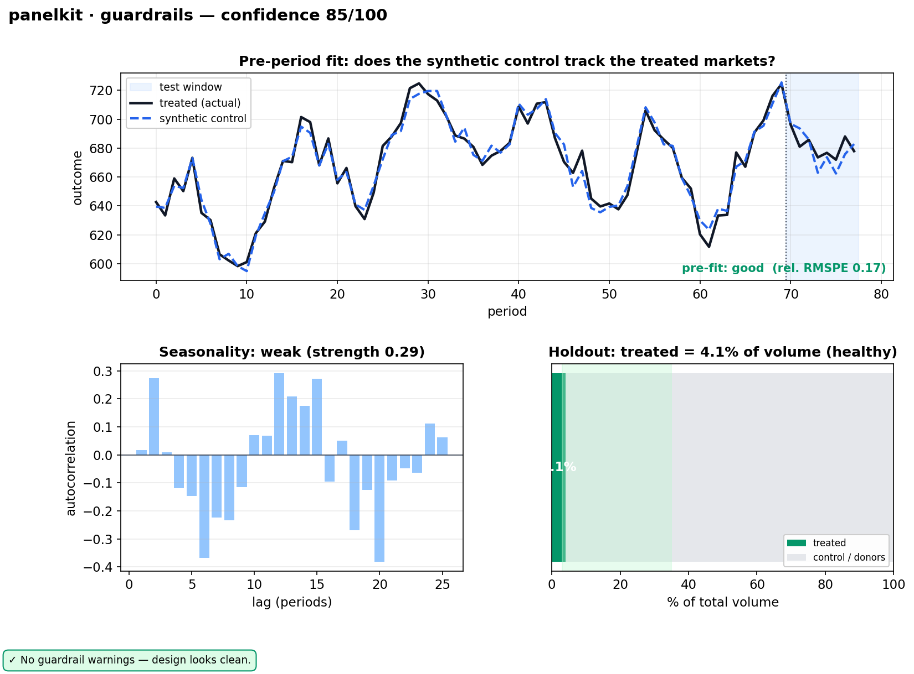
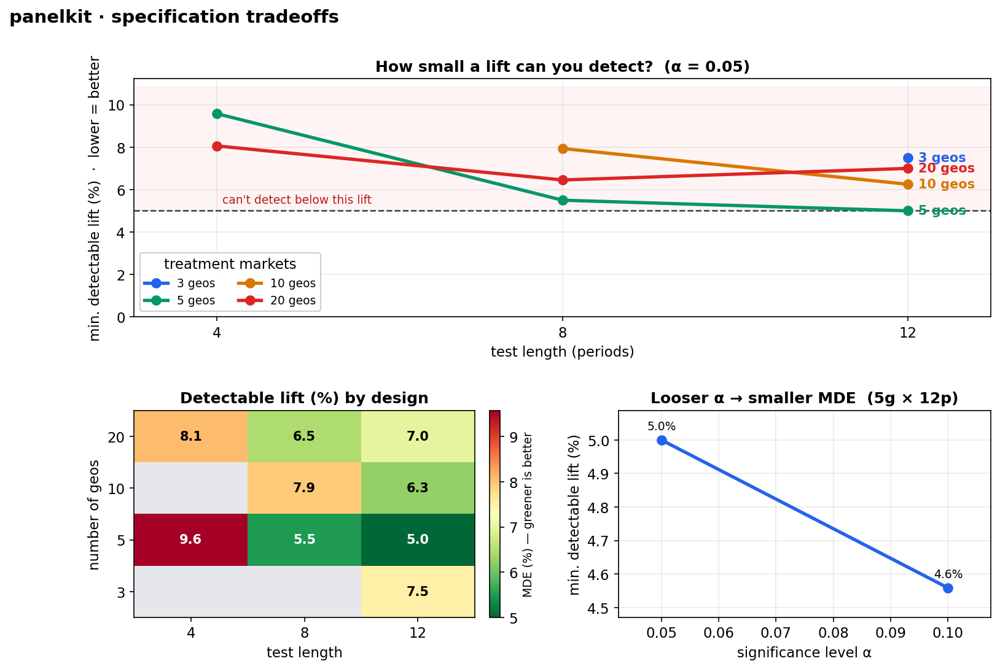
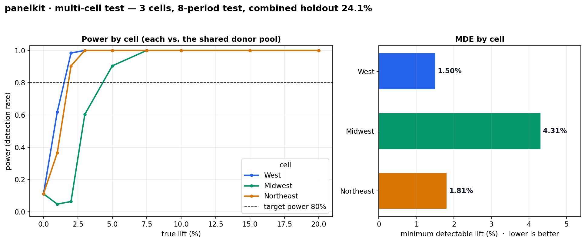
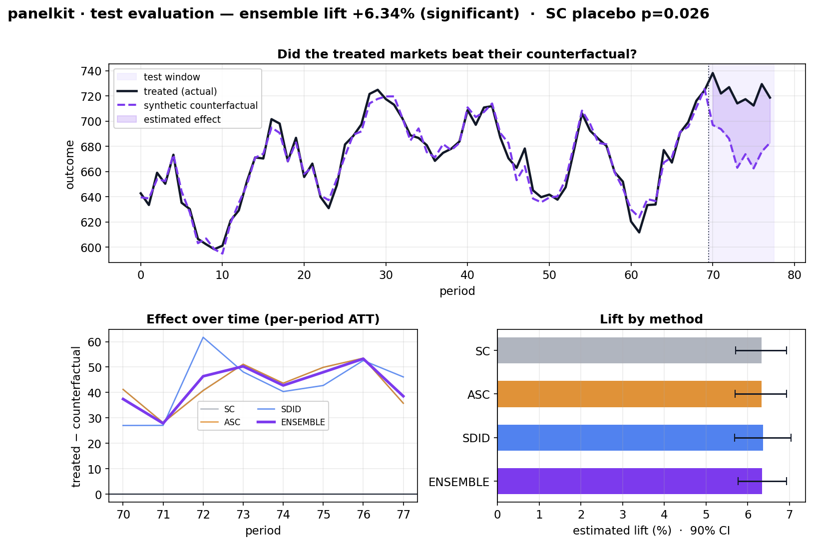
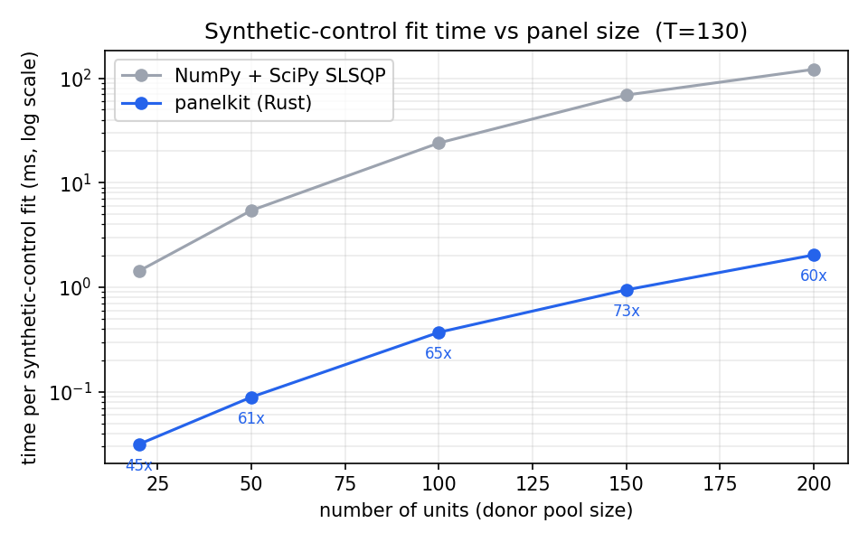
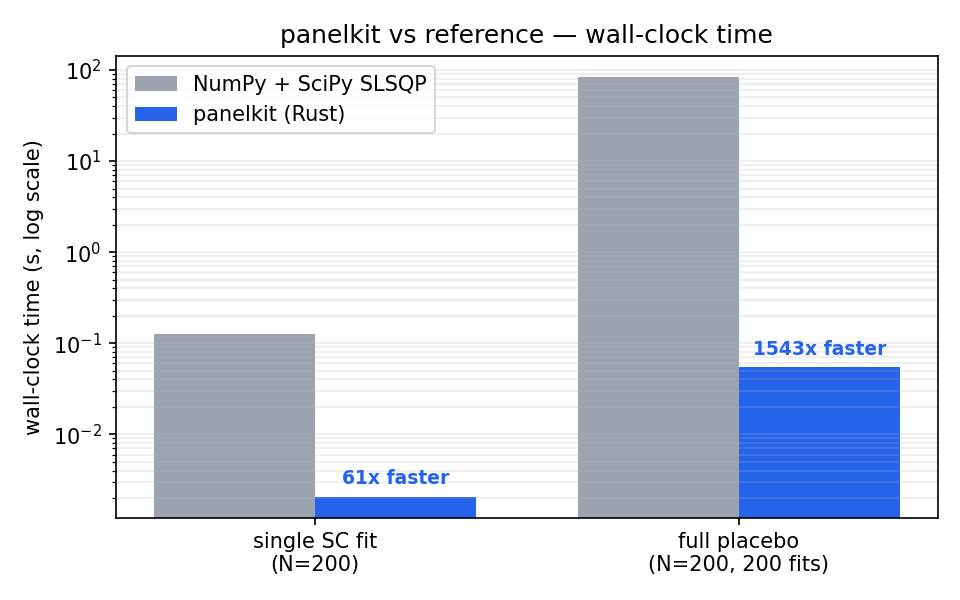
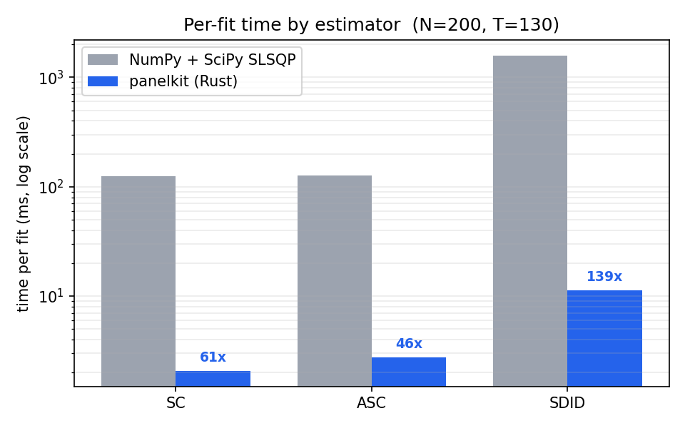

# panelkit

Fast, **from-scratch** causal-inference estimators for panel / geo experiments —
written in Rust, exposed to Python.

panelkit reimplements the standard panel causal-inference toolbox on top of its
own dependency-free numerical core (no BLAS/LAPACK, no `ndarray`, no `rand`), so
the whole stack is self-contained, deterministic, and fast. The numerical core
(`panelkit-linalg`) is a standalone crate intended to also back sibling projects
(e.g. a future time-series library).

- **Fast:** ~45–70× a NumPy+SciPy synthetic control on a single fit, ~1400× on a
  full placebo test (multithreaded). [Details.](BENCHMARKS.md)
- **Self-contained:** the numerical core is hand-written — matmul, Cholesky, QR,
  a one-sided Jacobi SVD, simplex solvers, and a PRNG, with zero numeric deps.
- **Reproducible:** all resampling inference is bit-identical regardless of
  thread count (deterministic per-replicate seed substreams).
- **Modern:** correct under staggered adoption (Callaway-Sant'Anna, Sun-Abraham)
  with a Goodman-Bacon diagnostic, plus a novel conformal-pooled SC family.

## Install

```bash
pip install panelkit            # once published; until then, build from source:

# from a clone (needs a Rust toolchain — https://rustup.rs — and maturin):
pip install maturin numpy
maturin develop --release --manifest-path crates/pypanelkit/Cargo.toml
```

## Data model — what your data should look like

Every estimator takes a single **`N × T` NumPy array `Y`**: one row per unit
(store, region, DMA, country…), one column per time period (week, month…), in
chronological order. `Y[i, t]` is the outcome for unit `i` at period `t`. The
panel must be **balanced** (no missing cells) — fill or aggregate gaps before
fitting. Treatment timing is passed separately, not encoded in `Y`.

```python
import numpy as np

#            t=0    t=1    t=2    t=3    t=4    t=5   ...   (periods →)
Y = np.array([
    [102.0, 104.0, 101.0, 130.0, 133.0, 131.0],   # unit 0  ← treated
    [ 98.0,  99.0,  97.0,  98.0, 100.0,  99.0],    # unit 1  (control/donor)
    [201.0, 205.0, 199.0, 204.0, 206.0, 203.0],    # unit 2  (control/donor)
    # ... one row per unit ...
])
# Here T=6 periods; say treatment starts at period 3 (so periods 0–2 are
# "pre", periods 3–5 are "post"). Unit 0 jumps ~+30 post-treatment.
```

Two ways to declare treatment:

- **Block treatment** (SC family, MC-NNM, CP-ASC) — a list of treated unit
  indices and the first post-treatment column:
  ```python
  SyntheticControl().fit(Y, treated=[0], treat_time=3)
  ```
- **Staggered adoption** (DiD family) — a per-unit `treat_start` array giving
  each unit's first-treated period; `-1` (or `None`) means never-treated:
  ```python
  # unit 0 treated at t=3, unit 2 at t=4, unit 1 never treated
  CallawaySantAnna().fit(Y, treat_start=[3, -1, 4])
  ```

**Coming from a long/tidy DataFrame** (`unit, period, outcome` rows)? Pivot to
the matrix first:
```python
Y = df.pivot(index="unit", columns="period", values="outcome").to_numpy()
```

Common gotchas: rows must be units and columns periods (not transposed);
periods must be in time order; the array is `float64` (panelkit copies/converts
as needed); and at least a couple of pre-treatment periods are required (more is
better — SC/SDID lean on pre-treatment fit).

## Estimators at a glance

| class | method | treatment | best for |
|---|---|---|---|
| `SyntheticControl` | Abadie et al. 2010 | block | one/few treated units, transparent weights |
| `AugmentedSC` | Ben-Michael et al. 2021 | block | poor pre-fit (ridge bias correction) |
| `SyntheticDiD` | Arkhangelsky et al. 2021 | block | **robust general default** |
| `MCNNM` | Athey et al. 2021 | block | low-rank structure, many treated cells |
| `CPASC` | novel (this project) | block, multi-treated | conservative pooled inference, cumulative $ lift |
| `TWFE` | two-way FE | staggered | baseline (biased under heterogeneity) |
| `CallawaySantAnna` | Callaway-Sant'Anna 2021 | staggered | **staggered adoption, event study** |
| `SunAbraham` | Sun-Abraham 2021 | staggered | staggered event study (saturated) |
| `GoodmanBacon` | Goodman-Bacon 2021 | staggered | *diagnostic*: why TWFE is biased |

## Examples

### Synthetic Control (+ placebo inference)

```python
import numpy as np
from panelkit import SyntheticControl

# Y: 50 units × 60 periods; unit 0 treated from period 45.
res = SyntheticControl(inference="placebo").fit(Y, treated=[0], treat_time=45)

res.att                 # average post-treatment effect
res.att_path            # per-period effects (length T_post)
res.counterfactual      # synthetic control's predicted path
res.weights             # donor weights (on the simplex)
res.donor_ids           # which units those weights correspond to
res.p_value             # in-space placebo p-value
print(res.summary())
```

### Synthetic DiD — the robust default

```python
from panelkit import SyntheticDiD

res = SyntheticDiD().fit(Y, treated=[0], treat_time=45)
print(res.att)          # unit + time weighted 2×2 DiD
```

### Augmented SC and MC-NNM

```python
from panelkit import AugmentedSC, MCNNM

AugmentedSC().fit(Y, treated=[0], treat_time=45).att          # ridge-corrected SC
MCNNM().fit(Y, treated=[0], treat_time=45).att                # low-rank completion, λ by CV
```

### CP-ASC — conformal pooled SC (multiple treated units)

```python
from panelkit import CPASC

treated = [0, 1, 2, 3, 4, 5]
res = CPASC(mode="mspe").fit(Y, treated, treat_time=22)   # CP-ASC
res.att                 # empirical-Bayes pooled ATT
res.p_value             # conformal block-permutation p-value
res.unit_att            # per-unit effects
res.unit_weight         # inverse-MSPE pooling weights

CPASC(mode="stratified").fit(Y, treated, 22)   # Strat-CP-ASC (size-robust)
CPASC(mode="cumulative").fit(Y, treated, 22)   # C-AS-CP-ASC (total-dollar target)
```

### Difference-in-differences with staggered adoption

```python
from panelkit import TWFE, CallawaySantAnna, SunAbraham, GoodmanBacon

# treat_start[i] = first treated period for unit i, or -1 if never treated.
cs = CallawaySantAnna().fit(Y, treat_start)
cs.att                  # overall ATT (cohort-size weighted)
cs.event_time           # relative event times, e.g. [-5,...,-1, 0, 1,...]
cs.event_att            # event-study coefficients (clean pre-trends + dynamics)
cs.event_se             # influence-function standard errors
print(cs.summary())

sa = SunAbraham().fit(Y, treat_start)           # interaction-weighted event study
twfe = TWFE().fit(Y, treat_start)               # baseline; biased under heterogeneity

# Goodman-Bacon: why TWFE is biased — decompose it into 2×2 comparisons.
bacon = GoodmanBacon().fit(Y, treat_start)
bacon.twfe              # == TWFE coefficient (Σ weightᵢ · estimateᵢ)
bacon.forbidden_weight  # weight on "already-treated as control" comparisons
print(bacon.summary())
```

Runnable scripts live in [`examples/`](examples/): `sc_demo.py`, `did_demo.py`,
`cpasc_demo.py`. See [GUIDE.md](GUIDE.md) for the estimand, assumptions, and
valid inference for each estimator.

## Geo test design (power analysis & market selection)

`panelkit.design` is the planning layer in front of a geo experiment —
multi-method and robustness-first, with the heavy simulation in Rust. It answers:
**which markets should I treat, how big a lift can I detect, can I trust this
design — and, once it's run, how big was the effect?**

```python
from panelkit.design import GeoDesign

# from a long/tidy DataFrame (location, date, outcome) — or GeoDesign(Y, names=…)
design = GeoDesign.from_long(df, location="dma", time="week", outcome="sales")

rep = design.power(treated=["chicago", "denver"], test_len=8, alpha=0.10)
print(rep.summary())          # plain-English report: MDE, confidence, warnings
rep.plot("design.png")        # the figure below

# guardrails: is this design trustworthy? (pre-fit, seasonality, holdout, warnings)
guard = design.diagnose(treated=["chicago", "denver"], test_len=8)
print(guard.summary())
guard.plot("guardrails.png")  # the guardrails figure below

# let it pick the markets for you:
ranked = design.select_markets(test_len=8, target_lift=0.05, max_treated=3)

# run several disjoint treatment cells at once (each vs. a shared donor pool):
mc = design.multi_cell(cells={"west": ["los_angeles", "san_diego"],
                              "east": ["boston", "philadelphia"]}, test_len=8)
print(mc.summary())           # per-cell MDE / confidence / holdout
mc.plot("multicell.png")      # the multi-cell figure below

# already ran the test? measure it (SC/ASC/SDID + a weighted-average ensemble):
ev = design.evaluate(treated=["chicago", "denver"], treat_start=52)
print(ev.summary())           # per-method + ensemble lift, CI, cumulative
ev.plot("evaluate.png")       # observed vs counterfactual + lift-by-method

# or sweep specifications (length × #geos × significance) and recommend one:
grid = design.recommend(test_lengths=[4, 6, 8, 12], n_geos_options=[3, 5, 10, 20],
                        target_lift=0.05, alphas=[0.05, 0.10])
print(grid.summary())
grid.plot("tradeoffs.png")    # the tradeoffs figure below
```



**Guardrails — can you trust the design?** `diagnose(...)` visualizes the
pre-period fit (treated vs synthetic control), seasonality, holdout share, and
surfaces plain-language warnings when the design is risky:



**Recommendations across specifications.** `recommend(...)` sweeps test length ×
number of geos × significance level (`alpha`) and points you at the cheapest
design that still detects your target lift — with a readable figure of the
tradeoffs (MDE vs length per #geos, an intuitive heatmap, and alpha sensitivity):



**Multi-cell tests.** `multi_cell(...)` runs several disjoint treatment cells
simultaneously — each measured against a shared donor pool that excludes *every*
cell's treated markets, so cells never borrow each other as controls. You get a
per-cell MDE/confidence/holdout report and a combined figure:



**Evaluate a test that ran.** `evaluate(...)` is the measurement counterpart to
the power analysis: fit SC / ASC / SDID on a test that already happened, blend
them into a weighted-average **ensemble** estimate, and report each one's lift,
confidence interval (stationary block bootstrap), and cumulative incremental —
with an SC in-space placebo p-value:



**Messy DataFrame? No problem.** `from_long` coerces real-world data: outcome
strings → numeric (with a clear error on genuinely non-numeric values), dates
(string or unsorted) → chronological columns, locations → market names, duplicate
rows aggregated with a warning, and a clear error (with a count) if the panel is
gappy. You don't pre-clean dtypes.

What you get out of the box:

- **Real-data power** — historical placebo with injected lift on your *actual*
  panel (not an assumed variance), across **SC, ASC, and SDID** with a
  recommended method, plus a naive-DiD baseline for improvement-over-naive.
- **MDE three ways** — minimum detectable effect as a **% lift**, an **absolute**
  per-period change, and the **cumulative** incremental over the whole window,
  each with confidence intervals.
- **Real-world guardrails** — seasonality detection, a pre-period **stability**
  score, **holdout** share, and plain-language **warnings** when the design is
  risky (weak fit, too few donors, short history, volatile markets).
- **A 0–100 confidence score** and a one-line verdict, so non-experts get a clear
  go/no-go.
- **Market selection** that searches candidate treatment sets and ranks them by
  power, MDE, fit, holdout, and confidence.
- **Multi-cell tests** — several disjoint treatment cells powered at once against
  a shared donor pool, with a per-cell MDE/confidence report.
- **A weighted-average ensemble** of SC + ASC + SDID (combined per placebo window,
  with auto inverse-variance weights) for a steadier estimate than any one method.
- **Post-test evaluation** — `evaluate()` measures a test that already ran:
  per-method + ensemble lift, bootstrap CIs, cumulative incremental, and a p-value.

See [`examples/geo_demo.py`](examples/geo_demo.py).

## Inference

| engine | use | determinism |
|---|---|---|
| placebo / permutation (in-space) | SC family, small N treated | order-independent |
| jackknife (leave-one-out) | SDID, N treated ≥ 2 | order-independent |
| multiplier (wild) bootstrap | C&S / SA influence functions | seeded substreams |
| conformal block permutation | CP-ASC, single-unit counterfactuals | order-independent |

All bootstrap/permutation engines produce **bit-identical** results regardless
of `RAYON_NUM_THREADS`, because replicate `b` always draws from
`Xoshiro256pp::substream(seed, b)`. Verified in CI at 1 and 8 threads.

## Performance

From-scratch Rust + multithreaded inference vs the textbook NumPy + SciPy-SLSQP
synthetic control. Numbers below are **measured live** by
[`benchmarks/make_plots.py`](benchmarks/make_plots.py) (median over 5 panels per
size, Apple M4 Pro; absolute times vary by hardware — re-run to regenerate).

A single synthetic-control fit, across donor-pool sizes (log scale):



The per-fit win compounds under inference — a full in-space placebo test runs one
fit per donor (here 200), multithreaded:



The constrained-weight estimators (SC, ASC, **SDID**) all beat the SLSQP
reference — SDID most of all, since it solves *two* constrained weight problems
per fit:



| task (200 × 130 panel) | panelkit | NumPy + SciPy-SLSQP | speedup |
|------|---------:|--------------------:|--------:|
| single SC fit | ~2.0 ms | ~125 ms | **~60×** |
| single ASC fit | ~2.7 ms | ~127 ms | **~46×** |
| single SDID fit | ~11 ms | ~1576 ms | **~139×** |
| full placebo (200 fits) | ~0.056 s | ~82 s | **~1467×** |

Estimates are identical (ATT |Δ| ≈ 1e-11; same placebo p-value) — this is pure
implementation speed, not an approximation. panelkit is also far steadier: SciPy
SLSQP has occasional convergence cliffs on near-collinear donor panels (one took
9.5 s in testing), which is why the table reports the median typical case.

**The honest exception — MC-NNM.** Matrix completion's bottleneck is the SVD,
and there our hand-written one-sided Jacobi SVD is **~20× slower** than NumPy's
`np.linalg.svd` (≈112 ms vs ≈5 ms per fit at N=200). NumPy calls **LAPACK** —
decades of hand-tuned, vendor-optimized assembly that a from-scratch SVD won't
beat. We keep MC-NNM self-contained rather than fast; if you need it at scale, a
LAPACK-backed SVD is the lever. See [BENCHMARKS.md](BENCHMARKS.md).

### How the speed happens — Frank–Wolfe vs SLSQP, in plain English

Synthetic control picks donor weights that (a) are non-negative and (b) sum to 1
— a *simplex-constrained* least-squares problem. Two ways to solve it:

- **SLSQP** (what the SciPy reference uses) is a general-purpose constrained
  optimizer: it handles arbitrary nonlinear objectives and constraints by
  repeatedly solving quadratic sub-problems and doing line searches. Powerful and
  general — but it pays for that generality with overhead, and it can stall
  (those convergence cliffs) when the donor columns are nearly collinear.
- **Frank–Wolfe** (what panelkit uses) is purpose-built for exactly this shape.
  Each step it asks one cheap question — "which single donor most improves the
  fit right now?" — moves toward that donor, and (in our *away-step* variant)
  can also pull weight *off* a donor that's hurting. No matrix inverses, no
  general constraint machinery; every step stays on the simplex by construction.

  - **Pros:** very fast per step, naturally produces sparse interpretable
    weights, no convergence cliffs, and the same routine powers SC, ASC, and both
    of SDID's weight problems.
    - **Cons:** it's specialized — it only solves this convex constrained shape,
      not arbitrary optimization. (For the one problem that *isn't* this shape —
      MC-NNM's SVD — we don't have a tuned-assembly equivalent, hence the
      exception above.)

That trade — a specialized solver where the problem is regular, honest about the
one place a general tuned library wins — is the whole performance story.

### Monte Carlo, power analysis & robustness sweeps

Running an estimator across thousands of simulated panels is the common heavy
workload (power curves, robustness checks). `fit_many` does the whole loop in
Rust across all cores — far faster than a Python `for` loop calling `.fit()`:

```python
import numpy as np
from panelkit import SyntheticControl

# stack of R simulated panels, shape (R, N, T)
stack = np.stack([simulate_panel(tau=1.0) for _ in range(2000)])
atts = SyntheticControl().fit_many(stack, treated=[0], treat_time=45)  # (2000,) ATTs
power = np.mean(np.abs(atts) > crit)        # ← one cell of a power curve
```

~2000 SC fits in ~0.05 s here; a full 5-point power curve (12k fits) in ~3.6 s.
See [`examples/power_demo.py`](examples/power_demo.py). More efficiency levers
for large runs are listed in [BENCHMARKS.md](BENCHMARKS.md#monte-carlo--scale).

## Architecture

A four-crate Cargo workspace with a strict dependency DAG:

```
linalg  ←  estimators  ←  inference  ←  pypanelkit (PyO3 bindings)
```

Only `pypanelkit` touches Python; `linalg` depends on nothing but `std`.

| crate | role |
|---|---|
| `panelkit-linalg` | `Mat`, GEMM/QR/Cholesky, one-sided Jacobi SVD, simplex solvers, SVT, RNG |
| `panelkit-estimators` | the estimators above, as functions of a `Panel` |
| `panelkit-inference` | resampling engines |
| `pypanelkit` | the `panelkit._panelkit` extension module |

## Development

```bash
cargo test --workspace                       # Rust tests (incl. SVD cross-oracle)
cargo clippy --workspace --all-targets -- -D warnings
cargo fmt --all -- --check
maturin develop --release --manifest-path crates/pypanelkit/Cargo.toml
pytest python/tests
cargo bench -p panelkit-estimators           # criterion micro-benchmarks
```

## License

MIT OR Apache-2.0.
